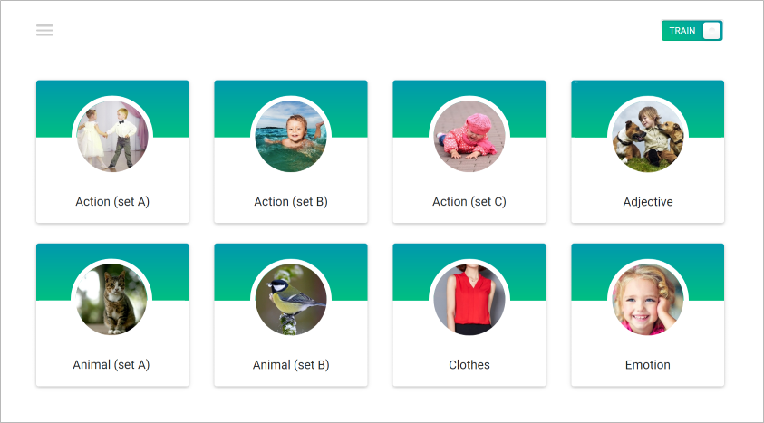

# English for kids

| Deadline         | Folder name| Branch name |
| ---------------- | ----------- | ----------- |
| 19.04.2020 23:59 | english-for-kids    | english-for-kids    |

1. Task: https://github.com/rolling-scopes-school/tasks/blob/master/tasks/rslang/english-for-kids.md
2. Screen: https://imgur.com/a/UzCupPR
3. Completed task: https://romanenkoandrew-english-for-kids.netlify.app
4. 19.04.2020 / 19.04.2020
5. Максимальный бал: 200 баллов
6. Оценка: 150 баллов

**English for kids** - приложение для изучения английских слов детьми.

## Структура приложения:
1. Главная страница
2. Страница категории 
3. Страница статистики 

## Описание страниц
1. Главная страница приложения
- на главной странице приложения размещаются ссылки на страницы с категориями слов
- минимальное количество категорий - восемь
- каждая ссылка содержит тематическую картинку и название категории
- ссылки дублируются в выезжающем боковом меню, которое открывается и скрывается по клику на иконку в левом верхнем углу страницы
- на главной странице приложения и на страницах категорий есть переключатель Train/Play (тренировка/игра)
  
2. Страница категории 
- страница категории содержит название категории и карточки со словами соответствующей тематики 
- минимальное количество карточек со словами в каждой категории - восемь   
- каждая карточка содержит тематическую картинку и слово на английском языке  
- при клике по карточке звучит произношение слова на английском языке  
- на каждой карточке есть кнопка, при клике по которой карточка переворачивается. На оборотной стороне карточки размещается перевод слова. При клике по оборотной стороне карточки ничего не происходит, произношение слова не звучит.
- обратный поворот карточки на лицевую сторону происходит автоматически, когда курсор мыши перемещается за её границы

3. Страница со статистикой 
- описание страницы находится в критериях оценивания (Hacker scope)

## Работа приложения
Приложение работает в режиме тренировки и в режиме игры.  
Описание работы приложения в данных режимах находится в критериях оценивания (Basic scope и Advanced scope соответственно).
При загрузке приложения или перезагрузке страницы приложение открывается в режиме тренировки.
Переключение между тренировкой и игрой происходит при клике по переключателю Train/Play. 

## Технические требования
- работа приложения проверяется в браузере Google Chrome последней версии
- использование jQuery не допускается
- нельзя использовать Angular/React/Vue 
- можно использовать bootstrap и любые другие css фреймворки
- можно использовать html и css препроцессоры
- подход к реализации многостраничности приложения, будь то разработка одностраничного (SPA) или многостраничного (MPA) приложения, а также реализация навигации между страницами остается на усмотрение разработчика
  - в случае имплементации одностраничного приложения (SPA) не обязательно реализовывать все характерные фичи данного подхода (например, routing), если в этом нет критической необходимости

## Требования к оформлению приложения
- минимальная ширина, при которой приложение отображается корректно – 320 рх
- так как приложение предназначено для обучения детей, в том числе и тех, которые ещё не умеют читать, все надписи, если это возможно, необходимо продублировать картинками или иконками
- желательны плавная анимация, интересный и уместный дизайн, большие и удобные кнопки, красочные иконки, красивые картинки, светлые и яркие тона
- должны присутствовать все элементы пользовательского интерфейса, представленные в демо, однако сам предложенный дизайн приложения не является обязательным и в него можно вносить свои изменения с целью улучшения
- дизайн конечного приложения должен выглядеть целостно: внешний вид соответствуют приложению, которым будут пользоваться потенциальные пользователи, картинки для карточек слов и категорий использованы хорошего качеcтва и в самом приложении они имеют одинаковый размер и правильные пропорции (отсутствуют какие-либо искажения), все элементы пользовательского интерфейса функционируют исправно, разметка не разваливается при изменении разрешения
- позаботьтесь об интерактивности кликабельных элементов - изменение внешнего вида самого элемента и состояния курсора при наведении, использование разных стилей для активного и неактивного состояния элемента

## Критерии оценки:
**Максимальный балл за задание: 170 баллов при кросс-чеке / 200 баллов при проверке ментором**   

### Basic scope +50/+80  

- **Вёрстка, дизайн, UI главной страницы приложения: (+10)**
  - [x] присутствуют все указанные в задании элементы как на мобильной, так и на десктопной версии
  - [x] выполнены все описанные требования к оформлению приложения
  
- **Вёрстка, дизайн, UI выезжающего меню: (+10)**
  - [x] выполнены все описанные требования к оформлению приложения
  - [x] ссылки в меню рабочие и ведут на страницы с категориями слов
  - [x] ссылка на текущую страницу внешне отличается от остальных
  - [x] выезжающее меню присутствует на всех страницах приложения
  - [x] плавная анимация выезжающего меню
  - [x] меню закрывается кликом по крестику, кликом по ссылке в меню, кликом в любом месте приложения, кроме самого меню 

- **Вёрстка, дизайн, UI страницы категории: (+10)**
  - [x] присутствуют все указанные в задании элементы как на мобильной, так и на десктопной версии
  - [x] выполнены все описанные требования к оформлению приложения

- **Режим тренировки: (+20)**
  - [x] при клике по карточке звучит произношение слова на английском языке: (+10)
  - [x] на каждой карточке есть кнопка, при клике по которой карточка поворачивается, на обратной стороне указан перевод слова. Когда курсор мыши перемещается за границы карточки, она автоматически поворачивается на лицевую сторону: (+10)
  
- **Выполнены требования к качеству кода (+30)** (оценивает только ментор)
  - [ ] дублирование кода сведено к минимуму: (+10)
  - [x] js-код разбит на модули: (+10)
  - [x] подключены и используются webpack, eslint, eslint-config-airbnb-base, babel: (+10)

### Advanced scope +80

- **Режим игры: (+80)**
  - [x] кликом по переключателю Train/Play включается режим игры. В режиме игры указанные выше возможности режима тренировки отключаются, кнопка, при клике по которой карточка переворачивалась, и текст на карточке скрываются. Появляется кнопка "Start game". Размер карточки не изменяется. На карточке остаётся только изображение, которое занимает всю её площадь (если это не противоречит вашему дизайну): (+10)  
  - [x] после клика по кнопке "Start game" звучит английское произношение рандомного слова из тех, что находятся на странице. Для каждой страницы, и для каждой игры рандомные слова генерируются по-новой: (+10) 
  - [x] после первого клика по кнопке "Start game" надпись на ней меняется на иконку "Repeat", меняется внешний вид кнопки. При клике по кнопке "Repeat" произношение слова звучит ещё раз: (+10)
  - [x] если пользователь кликнул по активной карточке с неправильным ответом, раздаётся звуковой сигнал "error": (+10)
  - [x] если пользователь кликнул по активной карточке с правильным ответом, раздаётся звуковой сигнал "correct" и после него звучит произношение рандомного слова из тех, которые ещё не звучали: (+10)
  - [x] карточка с угаданным словом становится неактивной, при этом изменяется её внешний вид. Клики по неактивной карточке звуковыми эффектами не сопровождаются, на счёт игры не влияют: (+10)
  - [x] после начала игры каждый клик по активной карточке является правильным или неправильным ответом. Эти ответы отображаются в виде звёздочек (или других символов) разного цвета в шкале с рейтингом, которая появляется в режиме игры. Если звёздочек слишком много и шкала заполнена ими полностью, предыдущие звёздочки скрываются, а новые продолжают добавляться: (+10)
  - [x] когда угаданы все слова в категории: (+10) 
    - если все слова угаданы правильно, звучит сигнал "success", карточки со словами скрываются, на странице отображается радостный смайлик (или другая картинка)
    - если при угадывании слов были ошибки, звучит сигнал "failure", карточки со словами скрываются, на странице отображается грустный смайлик (или другая картинка) и количество допущенных ошибок.
    - приложение автоматически перенаправляет на главную страницу со списком категорий

### Hacker scope +40

- **Страница статистики: (+40)**
  - [ ]  страница со статистикой содержит перечень всех категорий, всех слов в каждой категории, перевод каждого слова. Минимальная ширина, при которой страница статистики отображается корректно – 320 рх. Не является ошибкой наличие в таблице со статистикой полосы прокрутки: (+10)
  - [ ] возле каждого слова указывается статистика - сколько раз по карточки с данным словом кликали в режиме тренировки, сколько раз данное слово угадывали в режиме игры, сколько ошибок при этом допустили, процент правильных ответов по каждому слову в режиме игры. После перезагрузки приложения статистика сохраняется: (+10)
  - [ ] есть возможность сортировки данных по алфавиту, для числовых значений - по их величине. Сортировка может происходить в прямом и обратном порядке и должна охватывать весь диапазон данных: (+10)
  - [ ] на странице со статистикой размещены кнопки "Repeat difficult words" и "Reset". Кнопка "Reset" обнуляет статистику. При клике по кнопке "Repeat difficult words" открывается страница изучения слов с наибольшим процентом ошибок аналогичная странице категории. На странице "Repeat difficult words" может размещаться от нуля до восьми слов, в зависимости от того сколько слов угадывалось в режиме игры и при их угадывании были допущены ошибки. После нажатия на кнопку "Reset" количество слов на странице "Repeat difficult words" равно нулю: (+10)
  - [ ] реализован дополнительный, не предусмотренный заданием функционал. Не оценивается, но, если можете сделать лучше, почему бы и нет.

## Штрафные баллы
- [ ] меньше восьми категорий, меньше восьми слов в каждой категории, данные для двух последних категорий скопированы с демо, а не подготовлены самостоятельно: -10 баллов 
- [ ] не выполняются требования к pull request, репозиторию, названиям коммитов: -10 баллов (оценивает только ментор)
- [ ] не выполняются требования к коду: -10 баллов и больше (оценивает только ментор)
